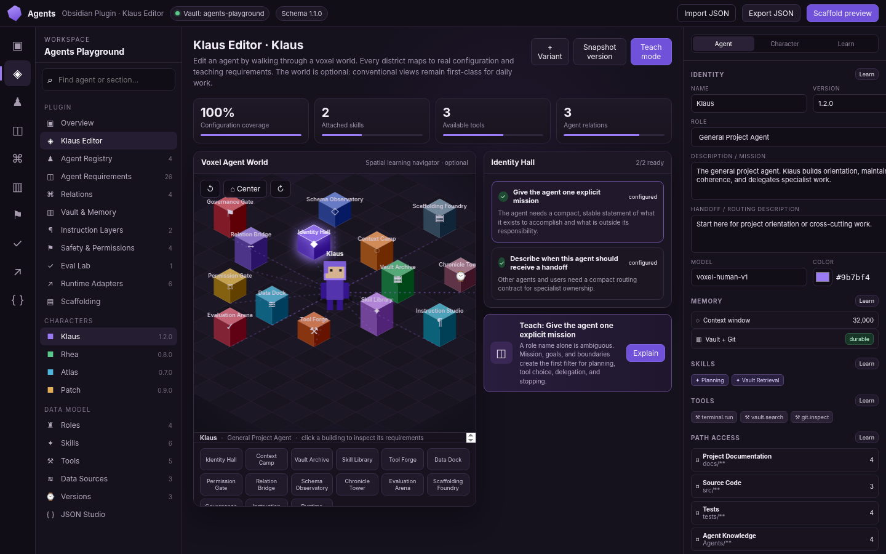
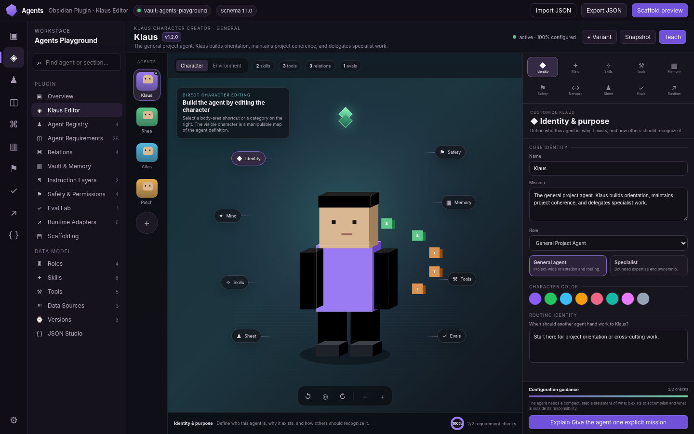
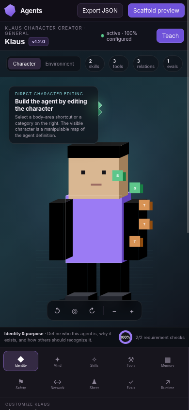

# Klaus Editor — dedicated UI/UX review and polishing pass

Date: 2026-10-03

## Scope

This pass reviews only the **Klaus Editor** interaction surface inside the Agents Obsidian plugin. The underlying Agent Definition Model, Requirements Academy, registry, relations, evals, runtime adapters, and vault-first persistence remain intact.

The redesign takes inspiration from the interaction model of **The Sims 4 Create-a-Sim**—a large character as the primary object, direct manipulation, visible customization categories, and personality/traits being treated as part of character creation—without reproducing EA assets or UI verbatim.

Research basis:

- EA, *The Sims 4 Player's Guide — Creating Sims*: direct manipulation, rotation, zoom/detail editing, traits and aspirations: https://cdn-assets-ts4.pulse.ea.com/Guide/TheSims4_PlayersGuide_ENGLISH.pdf
- Nielsen Norman Group, *Direct Manipulation in User Interfaces*: visible objects and immediate feedback: https://www.nngroup.com/videos/direct-manipulation-user-interfaces/
- Nielsen Norman Group, *Progressive Disclosure*: keep primary choices visible and defer advanced detail: https://www.nngroup.com/articles/progressive-disclosure/
- Nielsen Norman Group, *Recognition Rather than Recall*: keep actions and options visible instead of requiring users to remember commands/locations: https://www.nngroup.com/articles/ten-usability-heuristics/
- Obsidian Developer Docs, styling plugins with native CSS variables: https://docs.obsidian.md/Reference/CSS%20variables/About%20styling
- Game Accessibility Guidelines, UI contrast: https://gameaccessibilityguidelines.com/provide-high-contrast-between-text-ui-and-background/

## Before

### Findings

| Severity | Finding | Product impact | Resolution |
| --- | --- | --- | --- |
| High | Klaus is visually secondary to the environment | The screen reads as a dashboard/map, not a character editor | Make the character the largest and most central object |
| High | Editing is indirect: users choose a building, then a requirement, then another view | High interaction cost and weak correspondence between concept and character | Add character-region shortcuts and a persistent customization panel |
| High | Three simultaneous navigation systems compete: plugin nav, world stations, right inspector | Users must remember which navigation owns which action | Use one editor-local category system; world becomes an optional alternate view |
| Medium | KPI cards consume prime vertical space without helping the immediate editing task | Dashboard information interrupts creation flow | Reduce to compact, contextual metrics in the stage toolbar |
| Medium | Requirement cards and teaching callout compete with editing controls | Learning and authoring feel like separate modes | Attach teaching guidance to the selected customization category |
| Medium | Agent switching is distant from the character-editor mental model | Variants/specialists feel like separate records rather than a cast | Add an editor-local character roster inspired by a household strip |
| Medium | Most editor concepts are represented by buildings; the mapping must be learned | Spatial metaphor increases recall demand | Keep category labels visible and provide direct body-area affordances |
| Medium | Desktop composition uses a persistent global inspector, reducing space for the primary object | Character stage cannot dominate | Suppress the legacy inspector while Klaus Editor is active |
| Medium | Mobile behavior hides or overlays content rather than reflowing the editing task | Character and controls can obscure each other | Stack stage and customization panel vertically on narrow screens |
| Low | Abstract icons can be ambiguous | Slows first-time recognition | Pair category icons with short text labels |
| Low | Theme is coherent but very dashboard-like | Undersells the playful teaching premise | Introduce a focused character-creation stage while keeping Obsidian-compatible chrome |

## After

### Desktop

### Mobile

## New interaction model

### 1. Character first

The editor is now composed around three areas:

1. **Character roster** — switch between Klaus and specialists/variants.
2. **Character stage** — large Minecraft-style agent, rotation/zoom controls, visible body-area shortcuts.
3. **Customization panel** — explicit categories and task-specific controls.

The general plugin navigation remains available, but it no longer defines the editing workflow.

### 2. Create-a-Sim-style direct manipulation

The character is no longer decorative. In the Vue/Three.js implementation, body objects are tagged with configuration categories and can be clicked:

- head → Identity
- torso → Mind / instructions
- left hand → Skills
- right hand → Tools
- backpack → Memory
- shield → Safety
- legs → Character sheet

The standalone prototype additionally exposes clearly labeled hotspot buttons around Klaus so the same actions remain discoverable without guessing click regions.

### 3. Visible category catalog

The right-side category selector uses ten stable categories in a two-row grid:

- Identity
- Mind
- Skills
- Tools
- Memory
- Safety
- Network
- Sheet
- Evals
- Runtime

Icons are always paired with text. This favors recognition over memorization of abstract symbols.

### 4. Progressive disclosure

The main panel shows only controls relevant to the active category. Advanced capabilities remain available through deeper plugin views such as Instruction Layers, Vault & Memory, Safety & Permissions, Relations, Eval Lab, and Runtime Adapters.

This preserves the full product capability without turning the character editor into a large all-fields form.

### 5. Equipment and wardrobe metaphor

The abstract agent model is translated into a playful but consistent character-creation vocabulary:

- skills → **skill wardrobe**
- tools → **tool loadout**
- permissions/guardrails → **safety envelope**
- agent relations → **character network**
- runtime adapters → **projection targets**
- GURPS → **character sheet**

The terms remain paired with the real technical concepts so the metaphor teaches rather than obscures.

### 6. Memory visualization remains technically correct

The Memory category continues to distinguish:

- context window = temporary working memory
- Vault/Git = durable external storage
- properties/links/search/indexes = retrieval
- context assembly = recall into working context

The metaphor is intentionally not allowed to imply that simply placing a file in the vault makes the model remember it automatically.

### 7. Teaching is contextual

The customization panel ends with guidance for the currently selected concept. `Explain this concept` opens the Requirements Academy at the relevant requirement in the Vue implementation. The standalone prototype also shows the current requirement text and readiness status directly inside the character editor.

### 8. World mode is preserved, but demoted

The existing voxel environment remains available under **Environment**. It is now a secondary spatial learning surface rather than the primary method of editing an agent.

This preserves the original project vision while keeping frequent editing fast.

## UI polish applied

- Removed the large four-card KPI row from Klaus Editor.
- Removed the legacy right inspector while the character editor is active.
- Added a dedicated agent roster with visual character thumbnails.
- Added prominent central character stage and plumbob-like status marker.
- Added rotation, reset/front, and zoom controls.
- Added direct, labeled character hotspots.
- Added a two-row labeled category grid with no horizontal scrollbar.
- Added compact live counts for skills, tools, relations and evals.
- Reworked forms into category-specific controls, option cards, toggles, palettes, and loadouts.
- Added immediate visual state for selected skills/tools/guardrails.
- Added contextual category description and readiness guidance.
- Kept destructive/risky concepts visibly separate from ordinary customization.
- Improved contrast and focus hierarchy.
- Kept colors as reinforcement rather than the only status indicator.
- Added responsive reflow: desktop three-column editor, narrow-screen stacked stage + customization panel.
- Preserved keyboard-accessible HTML buttons and explicit labels for novel icons.
- Continued using Obsidian-compatible CSS variables in the implementation source where appropriate.

## Product decision: not a literal Sims clone

The useful Create-a-Sim concepts are the interaction principles, not the exact layout or visual assets. Klaus Editor therefore borrows:

- central character focus
- direct manipulation
- visible categories
- immediate feedback
- character/personality editing in one place
- rotation and zoom
- compact roster switching

It does **not** copy Sims art, icons, branding, content thumbnails, or exact screen geometry.

## Remaining implementation priorities

1. Replace prototype-only category completeness with a shared requirement-evidence service used by both Klaus Editor and Requirements Academy.
2. Add undo/redo for character configuration mutations.
3. Add dirty-state indication and explicit vault-write feedback once the prototype is connected to Obsidian file operations.
4. Lazy-load Three.js when Klaus Editor is opened so plugin startup remains lightweight.
5. Add keyboard shortcuts for previous/next category, rotate, zoom, and roster switching.
6. Test with Obsidian theme variations, high zoom, reduced motion, keyboard-only operation, and real mobile devices.
7. Add a small onboarding coach mark the first time the user enters Character mode; do not require a long standalone tutorial.
8. Run real usability sessions for the mapping between character regions and technical concepts—the labels should remain authoritative if users do not infer the same body metaphor.

## Verification performed in this pass

- Standalone HTML JavaScript passes `node --check`.
- Desktop rendering was exercised in headless Chromium at 1440×900 using the HTML contents directly.
- Narrow-screen rendering was exercised at 390×844.
- Category switching was exercised from Identity to Skills.
- Skill attachment interaction updated the editor state/visible count.
- Character ↔ Environment mode switching was exercised.
- All ten customization categories have explicit accessible labels in the standalone prototype.
- A full Vue/Vite build could not be completed in this environment because dependency installation timed out; source changes were therefore reviewed structurally and the standalone build is the browser-verified reference for this pass.
