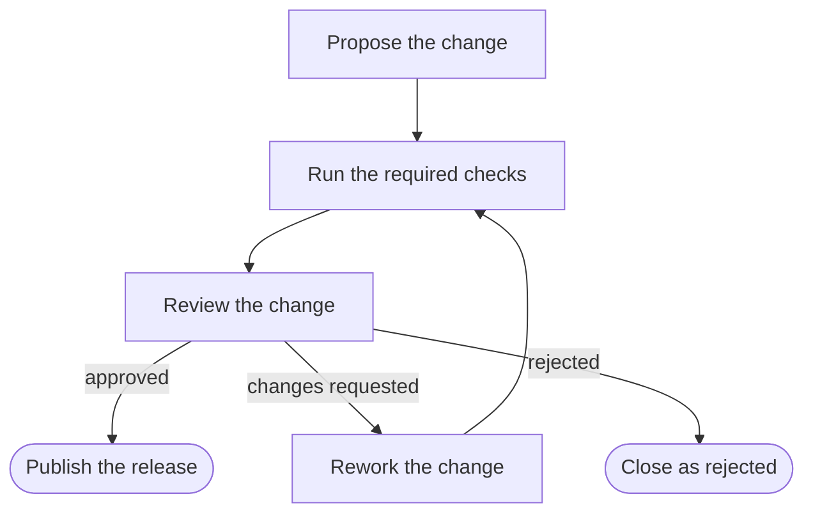

<!-- process:generated:start sha256=1e547cd1e71c06b09e57d1cced91daf3c70148bafda1c725923b51a8602c90d4 -->
# Release approval

> Business process `release-approval` · version 1 · active · owner: Maintainer

## Purpose

Take one change from proposal to a published release with the delivery rules of this repository: reviewed file plans, required checks with honest untested scope, an approving review and an explicitly requested publication.

This process mirrors how changes reach a release in this repository. It is an example of a
data-driven business process: the steps, rules and these notes are data in
`configs/processes/release-approval.json`, documented and checked by `node bin/app process`.

The delivery rules come from [the repository instructions](../../AGENTS.md). How processes, rules and
generated documentation work is described in [docs/development/BUSINESS-PROCESSES](../development/BUSINESS-PROCESSES.md).

## Roles

| Role | ID | Responsibilities | Steps |
| --- | --- | --- | --- |
| Contributor | `contributor` | Proposes the change, runs the gates and reports real output. | Propose the change; Run the required checks; Rework the change |
| Maintainer | `maintainer` | Reviews the change and decides whether it ships. | Review the change; Close as rejected |
| Release manager | `release-manager` | Publishes a release only when the owner explicitly asked for it. | Publish the release |

## Steps

| # | Step | Actor | Inputs | Outputs | Next |
| --- | --- | --- | --- | --- | --- |
| 1 | Propose the change (`propose`) | Contributor | Change title; Kind of change; Did every write go through a reviewed, hash-approved file plan? | — | `checks` |
| 2 | Run the required checks (`checks`) | Contributor | Type check; Lint; Relevant test suites; Live security audit (check:security); Line coverage of the changed code (%); Untested scope (write none when everything was tested) | — | `review` |
| 3 | Review the change (`review`) | Maintainer | Decision; Approving reviews so far | — | `publish` if `review.decision equals "approve"`; `rework` if `review.decision equals "changes"`; `rejected` |
| 4 | Rework the change (`rework`) | Contributor | What changed after the review? | — | `checks` |
| 5 | Publish the release (`publish`) | Release manager | Did the owner explicitly request this publication?; Release version (major.minor.patch); Is the CHANGELOG entry written?; Execution record path (optional) | — | ends (released) |
| 6 | Close as rejected (`rejected`) | Maintainer | confirmation | — | ends (rejected) |

## Flow

## Business rules

Block rules stop a transition, warn rules need an explicit acknowledgement and info rules are recorded.

### Block

| Rule | Statement | Scope | Condition | Rationale |
| --- | --- | --- | --- | --- |
| `reviewed-file-plans` | Every write goes through a reviewed, hash-approved file plan. | `propose` | require `change.planReviewed equals true` | Nothing in this repository overwrites user files silently. |
| `required-checks-pass` | Type check, lint and the relevant test suites pass before review. | `checks` | require `all(checks.typecheck equals "passed", checks.lint equals "passed", checks.tests equals "passed")` | Reviewers judge real gate output, not assumed success. |
| `coverage-floor` | Changed feature and fix code keeps at least 90 % line coverage. | `checks` | when `change.kind in ["feature","fix"]`, require `checks.coverage gte 90` | The maker coverage gate never weakens; moving code does not lower its floor. |
| `approval-before-publish` | An approved change has at least one approving review. | `review` | when `review.decision equals "approve"`, require `review.approvals gte 1` | — |
| `explicit-publish-request` | Publishing and tagging happen only when the owner explicitly requested them. | `publish` | require `release.requested equals true` | — |
| `semantic-version` | The release version has three dot-separated parts. | `publish` | require `all(release.version matches "?*.?*.?*", not(release.version contains " "))` | — |

### Warn

| Rule | Statement | Scope | Condition | Rationale |
| --- | --- | --- | --- | --- |
| `dependency-audit` | A dependency change runs the live security audit. | `checks` | when `change.kind equals "dependency"`, require `checks.audit equals "passed"` | An audit that was not run is reported honestly; the maintainer decides whether to continue. |
| `untested-scope-stated` | The change states its untested scope. | `checks` | require `checks.untested length gte 1` | — |
| `changelog-entry` | The CHANGELOG has an entry for the release. | `publish` | require `release.changelog equals true` | — |

### Info

| Rule | Statement | Scope | Condition | Rationale |
| --- | --- | --- | --- | --- |
| `execution-record-linked` | The release links its execution record under docs/. | `publish` | require `release.notesLink matches "docs/*"` | — |

## Step details

### 1. Propose the change

Actor: Contributor. Next: `checks`.

Describe the change and confirm that every write went through a reviewed, hash-approved file plan.

Inputs:

- Change title (title)
- Kind of change (select)
- Did every write go through a reviewed, hash-approved file plan? (boolean)

Rules checked here:

- block `reviewed-file-plans`: Every write goes through a reviewed, hash-approved file plan.

### 2. Run the required checks

Actor: Contributor. Next: `review`.

Run the gates and paste their real output; a check that was not run is reported as not run, never as passed.

Inputs:

- Type check (select)
- Lint (select)
- Relevant test suites (select)
- Live security audit (check:security) (select)
- Line coverage of the changed code (%) (number)
- Untested scope (write none when everything was tested) (text)

Suites and their purpose are listed in [docs/testing/TEST-SUITES](../testing/TEST-SUITES.md). Coverage floors come from the reviewed thresholds and may only tighten.

Rules checked here:

- block `required-checks-pass`: Type check, lint and the relevant test suites pass before review.
- block `coverage-floor`: Changed feature and fix code keeps at least 90 % line coverage.
- warn `dependency-audit`: A dependency change runs the live security audit.
- warn `untested-scope-stated`: The change states its untested scope.

### 3. Review the change

Actor: Maintainer. Next: `publish` if `review.decision equals "approve"`; `rework` if `review.decision equals "changes"`; `rejected`.

Read the diff, the gate output and the untested scope, then decide.

Inputs:

- Decision (select)
- Approving reviews so far (number)

Rules checked here:

- block `approval-before-publish`: An approved change has at least one approving review.

### 4. Rework the change

Actor: Contributor. Next: `checks`.

Inputs:

- What changed after the review? (text, required)

### 5. Publish the release

Actor: Release manager. Next: ends (released).

Tag and publish only on the owner's explicit request; the changelog names the release.

Inputs:

- Did the owner explicitly request this publication? (boolean)
- Release version (major.minor.patch) (text, required)
- Is the CHANGELOG entry written? (boolean)
- Execution record path (optional) (text)

Rules checked here:

- block `explicit-publish-request`: Publishing and tagging happen only when the owner explicitly requested them.
- block `semantic-version`: The release version has three dot-separated parts.
- warn `changelog-entry`: The CHANGELOG has an entry for the release.
- info `execution-record-linked`: The release links its execution record under docs/.

See the safety rules in [AGENTS](../../AGENTS.md): no task publishes, tags or submits listings unless specifically requested.

### 6. Close as rejected

Actor: Maintainer. Next: ends (rejected).

## Related documentation

- Source notes: `configs/processes/docs/release-approval.md`
- [AGENTS.md](../../AGENTS.md)
- [docs/development/BUSINESS-PROCESSES.md](../development/BUSINESS-PROCESSES.md)
- [docs/testing/TEST-SUITES.md](../testing/TEST-SUITES.md)

Generated from `configs/processes/release-approval.json` by `node bin/app process docs --name release-approval`. Edit the definition, not this block.
<!-- process:generated:end -->

## Notes

Hand-written notes outside the generated block are kept when this page is regenerated.
